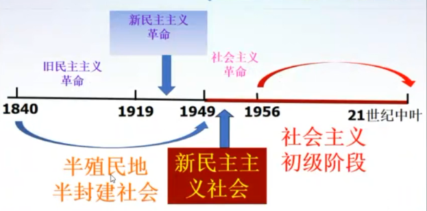
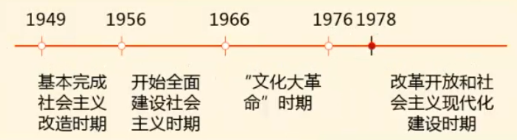

# 中化人民共和国的成立和中国进入社会主义初级阶段  
## 中华人民共和国成立的历史意义  
1. 资本-帝国主义列强奴役中国人民的历史从此结束,中国人从此站起来.  
2. 封建主义官僚资本主义统治从此结束,真正属于人民的共和国建立起来了.  
3. 军阀割据、战乱频频的历史从此结束,可集中力量搞建设的时期到来了.  
4. 为通过新民主主义向社会主义过渡实现中华复兴,创造了政治前提.  
5. 中国共产党成为全国的执政党,为社会主义现代化建设提供了根本的政治保证.  
中华人民共和国的成立,标志着新民主主义革命取得了基本胜利,**标志着**半殖民地半封建社会的结束,标志着**新民主主义社会**在全国范围内的建立。  
半殖民地半封建社会→新民主主义社会  
## 新民主主义社会向社会主义的过度  
五大社会形态:原始,奴隶,封建,资本主义,共产主义(初级阶段为社会主义)  
新民主主义社会属于社会主义体系  
五种经济成分:国营经济19%,国家资本主义经济1%,私营经济7%,个体经济72%,合作社经济1%  
基本阶级力量:工人,民族资产阶级,农民及其它小资产.无产阶级与资本阶级的矛盾,社会注意与资本主义的矛盾  
## 过渡时期的总路线  
社会主义工业化的同时逐步实现三大改造  
三大改造:农业,手工业和资本主义工商业  
  
# 新中国发展的两个历史时期以及其相互关系  
  
## 如何科学评价改革开放前后两个历史时期  
上世纪八十年代，我国较快解决了吃饭问题  
推广家庭联产承包责任制的实行,改革开放前农田**水利工程**的大规模建设,**化肥的引进**、改造和**粮种的改良**尤其是杂交水稻的培育成功  
人工天河:红旗渠  
(一)  只是两个即相互联系又有重大区别的时期,但本质上都是我们党领导人民进行社会主义建设的实践探索.  
|区别|改革开放前|改革开放后|  
|:--:|:--------:|:--------:|  
|指导思想|马列主义、毛泽东思想|马列主义、毛泽东思想、中特理论|  
|方针政策|工业化、抓革命促生产|经济建设为中心、改革开放|  
(二)  要正确评价两个历史时期,需确认真把握一下四个方面  
1. 一方面,如果没有改革开放前近30年的建设,建立了**比较完整的工业体系和国民经济体系**,积累了重要的思想、物质和制度条件,积累了正反两方面经验,改革开放很难顺利进行;另一方面,如果没有改革开放,如果没有坚定不移地把握**改革开放的社会主义方向**,中国就不可能有今天这样的局面,就可能面临苏东剧变那样的亡党亡国危机。
2. 虽然这两个历史时期在社会主义建设的指导思想、方针政策、实际工作上有很大差别,但两者绝不是彼此割裂、根本对立的。  
3. 对改革开放前的历史时期要完整、准确地评价,决不能用改革开放后的历史时期否定改革开放前的历史时期,也不能用改革开放前的历史时期否定改革开放后的历史时期。改革开放前的社会主义实践探索为改革开放后的实践探索奠定了基础,改革开放后历史时期是对改革开放前历史时期的坚持、改革和发展。  
4. 对改革开放前后两个历史时期都要实事求是地“一分为二”,分清主流和支流、成就和失误,以便更好地坚持真理,改正错误,发扬经验,汲取教训,在此基础上把社会主义事业继续推向前进。  
**总之,改革开放前后两个历史时期不能相互否定也不应该相互否定,应该认真总结和汲取两个历史时期的经验教训更好地推进社会主义现代化事业。**  

