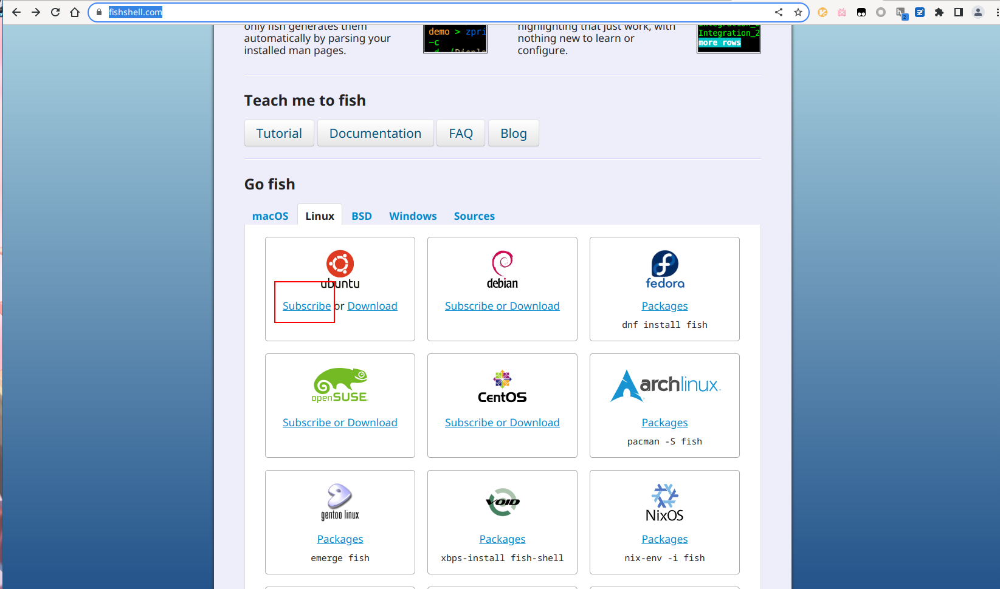

# Tue Feb 28 10:27:07 AM CST 2023
&emsp;&emsp;之前在知网上找智能无人叉车论文没找到别人的具体方案，找到的大部分都是视觉算法，这两天直接在必应上搜索相关方案了。
&emsp;&emsp;智能无人驾驶叉车，也叫AGV叉车。AGV叉车有两类方案，一类是自由路径方式，另一类是固定路径方式。[1](https://zhuanlan.zhihu.com/p/158551032)
&emsp;&emsp;在识别方面，识别可以用视觉轮廓识别，导航可以使用视觉SLAM导航。目前还没定好要用但目摄像头还是双目摄像头。  

  
  


# Thu Mar  2 10:51:48 AM CST 2023
&emsp;&emsp;这两天在配置vnc，但是TX2不像树莓派那样可以不插显示器就能强制输出HDMI信号，TX2不插显示器就不会有:0桌面，所以TX2不插显示器无法使用x0vncserver和vino，除非用xorg什么玩意dummy创建一个虚拟显示器，但是创建了这个虚拟显示器之后，物理显示器就没办法显示了，为了不让后人使用这个TX2的时候误认为这个TX2坏掉了，我没有采用这个方案。
&emsp;&emsp;于是我采用vnc4server或者tigervnc创建虚拟桌面:1 :2的方式进行连接，每次都手动连接ssh启动vnc或者将vncserver的启动加入到启动文件里面去。  
&emsp;&emsp;但是我发现xstartup里面的图形程序一个都没有启动成功。我设置export DISPLAY=:1，然后手动启动报错  
```
# Error constructing proxy for org.gnome.Terminal:/org/gnome/Terminal/Factory0: Error calling StartServiceByName for org.gnome.Terminal: Timeout was reached
```  
&emsp;&emsp;问了一下new bing，它告诉我使用dbus-launch gnome-terminal 来启动，这次是启动成功了，但是返回一个信息
```
Unable to create /home/nvidia/.dbus/session-bus
```
&emsp;&emsp;查了一下发现home目录下.dbus的所有者是root，按理来说这个目录的权限应该是本用户才对，改了之后就可以使用了。  

&emsp;&emsp;搞了很久，gnome-session还是没办法启动，最后还是换了xfce4  
```bash
#!/bin/sh

# Uncomment the following two lines for normal desktop:
# unset SESSION_MANAGER
# exec /etc/X11/xinit/xinitrc

[ -x /etc/vnc/xstartup ] && exec /etc/vnc/xstartup
[ -r $HOME/.Xresources ] && xrdb $HOME/.Xresources
xsetroot -solid grey
vncconfig -iconic &
x-terminal-emulator -geometry 80x24+10+10 -ls -title "$VNCDESKTOP Desktop" &
# 下面这一行去掉，不然窗口管理器会和xfce4的xfwm4冲突, 导致xfce4的窗口管理器启动不起来  
#x-window-manager &
startxfce4 &
```
&emsp;&emsp;前面两行不要解除注释，解除注释之后就没办法启动了，我也不知道是为什么，应该是用xinitrc来启动桌面的时候才会用到前面两行  

&emsp;&emsp;vnc通过ssh连接之后手动输入vncserver 来启动，启动的第一个服务端口是5901   

安装fish shell 把默认shell  

```
sudo apt-add-repository ppa:fish-shell/release-3
sudo apt update
sudo apt install fish
```
[设置默认shell-通过 .bashrc 启动 fish](https://wiki.archlinuxcn.org/wiki/Fish?rdfrom=https%3A%2F%2Fwiki.archlinux.org%2Findex.php%3Ftitle%3DFish_%28%25E7%25AE%2580%25E4%25BD%2593%25E4%25B8%25AD%25E6%2596%2587%29%26redirect%3Dno#%E5%B0%86_fish_%E8%AE%BE%E4%B8%BA%E9%BB%98%E8%AE%A4_shell)
将`fish`加入到~./bashrc的最后一行  


在linux上安装conda，因为tx2是aarch64架构的，所以装archiconda更适合一些  
https://github.com/Archiconda/build-tools 下载release然后运行shell文件即可安装，或者用wget是下载  
```
wget https://github.com/Archiconda/build-tools/releases/download/0.2.3/Archiconda3-0.2.3-Linux-aarch64.sh
sudo sh Archiconda3-0.2.3-Linux-aarch64.sh
```
我用的是fish，安装程序询问是否将conda加入到.bashrc中，选择不加。安装完之后手动把`source ~/archiconda3/etc/fish/conf.d/conda.fish`加到~/.config/fish/config.fish中去


# Tue Mar  7 04:19:00 PM CST 2023

&emsp;&emsp;摄像头的读取  
```python
import cv2

cap = cv2.VideoCapture(1)
while(True):
    ret, frame = cap.read()
    cv2.imshow("video", frame)
    c = cv2.waitKey(50)
    if c == 27:
        break
```


# Thu Mar  9 05:27:10 PM CST 2023

```
conda create -n SOLOv2 python=3.9
conda activate SOLOv2
```

< 下面是官网的安装渠道，但是官网根本没有提供aarch64架构的whl，所以行不通
[pytorch](https://pytorch.org/get-started/locally/)
[找到对应CUDA版本](https://pytorch.org/get-started/previous-versions/)
```
pip3 install torch torchvision torchaudio --extra-index-url https://download.pytorch.org/whl/cu116
```
这时候就发现没有对应版本了  

< 下面换英伟达官网，我开了个梯子  
[PyTorch For Jetson](https://forums.developer.nvidia.com/t/pytorch-for-jetson/72048)

我的jetson tx2的jetson版本是4.6的，这样的话最高就只能选择 PyTorch v1.10.0 了，而且python版本必定需使用3.6的  

构建detectron2
https://detectron2.readthedocs.io/en/latest/tutorials/install.html

detectron2 最低python版本要求python3.7但是tx2最高pytorch只支持3.6  
方案1 把jetpack版本升上去安装更高版本的pytorch
> 方案1失败，因为TX2最高jetpack版本支持就4.6了，不能再高了

方案2 jetpack版本不变，手动编译pytorch  
我仍然选择pytorch1.8.0, 选择python3.8编译  
刚开始跟着csdn和官方的readme去编译了，但是好多包都不存在，后来才发现官方readme有一句
If you are building for NVIDIA's Jetson platforms (Jetson Nano, TX1, TX2, AGX Xavier), Instructions to install PyTorch for Jetson Nano are [available here](https://devtalk.nvidia.com/default/topic/1049071/jetson-nano/pytorch-for-jetson-nano/)  
才发现英伟达那个帖子不止提供whl包，还提供构建教程，只不过在下面没有展开。  

要注意的点  
1. 分配虚拟内存，在帖子最前面有说，要不然会发生段错误，听说峰值内存能到24G(我可分配不了这么大，目前分配的是5G虚拟内存+8G TX2的物理内存一共13G内存)  
2. 保证拥有足够的储存空间，TX2 32G储存空间还是太少了，我选择了插一个EXT4的U盘进去编译  

如果编译一直出现segment fault， 可以改一下代码，[这个帖子](https://blog.csdn.net/qq_38026359/article/details/122081604)  
编译了几次编译成功  


> 这个方案的问题：  
> 1. tx2 aarch64 框架很多包都没有二进制的，就算有也不符合算法要求，得自己编译 
> 2. 实例分割算法性能要求应该还是比较高的，TX2不知道能不能顶得住  
> 3. 数据集，如果要用机器视觉的话，数据集需要自己标，工作量还是比较大的   
> 另外，这个TX2是32G的，空间是真的小，系统加CUDA、CUDNN都快二十多G了，不够的话只能插卡把代码什么的放进去了    
> 现在开了个会之后，觉得改个方案，不用机器视觉实例分割了，直接使用传统视觉，比如颜色识别边缘检测之类的，还有通过二维码的辅助来进行识别，谢耀庆来给我看了一下ROS，ROS有很多相关的功能，所以打算从ROS入手  

# ros的安装  


