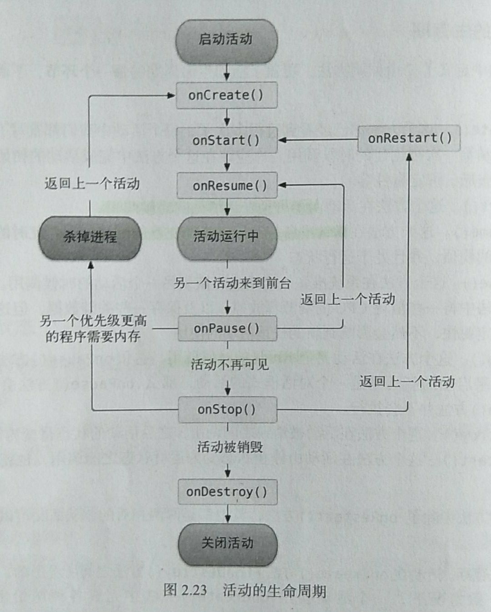

# 第2章 先从看得到的入手——探究活动  
## 2.4 活动的声明周期  
### 2.4.1 返回栈  
使用任务(task)管理活动,一个任务就是一组存放在返回栈(Back Stack)里的活动集合.  
栈:先进后出的数据结构  
#### 作用  
启动新活动入栈,finish()销毁活动出栈.  
系统总会显示处于栈顶的活动给用户.
### 2.4.2 活动状态
4种状态  
#### 运行状态  
栈顶、可见  
#### 暂停状态  
非栈顶、可见  
回收：内存极低时  
#### 停止状态  
非栈顶、完全不可见  
保留相应状态和成员变量  
回收：其他地方需要内存时  
#### 销毁状态  
返回栈中移除后  
回收：最倾向于回收处于这种状态的活动，确保内存充足    
### 2.4.3 活动的生存期  
Activity类中定义了7中回调方法。  
#### 完整生存周期  
- onCreat()  
- onDestroy()
#### 可见生存周期  
- onStart()  
- onStop()
#### 前台生存周期  
- onResume()
- onPause()
#### 此外
- onRestart()  
#### 生命周期示意图  


#### onStart和onRestert的区别  
onRestart()在Destory后在启动程序的情况下**不会启动**  
目前知道两种情况只启动onStart()不启动onRestart():  
1. 刚启动程序的时候  
2. 屏幕翻转(屏幕翻转会Destory这个活动然后重新创建启动)   

where in `Head First Android book` it is stated that:

>" : When you rotate the device, the activity is destroyed and a new one is created in its place. If we’d put code in the onRestart() method instead, it wouldn’t have run when the activity was re-created. The onStart() method gets called in both situations."

>onRestart() is called only if onStop() has been called before
>
>https://developer.android.com/guide/components/activities/activity-lifecycle.html
>
>The activity was stopped and you are RE-starting it hence onRestart(). The very first time or after the activity has been destroyed it's just onStart()

来源:[https://stackoverflow.com/questions/46867109/what-is-the-difference-between-onrestart-and-onstart](https://stackoverflow.com/questions/46867109/what-is-the-difference-between-onrestart-and-onstart)  

### 2.4.5 活动被回收了怎么办  
重写onSaveInstanceState()方法用Bundle类型的对象的putSting()方法将数据保存到Bundle对象中  
```Java
    @Override
    protected void onSaveInstanceState(Bundle outState) {
        super.onSaveInstanceState(outState);
        String tempData = "Something you just typed";
        outState.putString("data_key",tempData);
    }
```
主函数部分使用getString()方法获取  
```Java
    @Override
    protected void onCreate(Bundle savedInstanceState) {
        ...
        if (savedInstanceState != null) {
            String tempData = savedInstanceState.getString("data_key");
            Log.d(TAG, "onCreate:"+tempData);
        }
        ...
    }
```

## 2.5 活动的启动模式  
活动的启动模式分四种,在AndroidManifest.xml的<activity>标签指定android:launchMode属性来选择启动模式  
1. standerd  
2. singleTop  
3. singleTask  
4. singleInstace  
### standerd(default)  
不管这个活动是否已经存在栈中,每一次启动都会创建一个新的实例  
### singleTop  
当活动不再栈顶时,启动活动会创建新的实例;当活动在栈顶时,启动活动才会创建新的实例.  
也就是说,自己启动自己没啥反应(Pause在Resume一下);其他活动启动它和standerd一样会创建一个新的实例.  
可以防止重新创建栈顶活动.  
### singleTask  
在这个应用程序的(默认)返回栈中只存在一个实例.  
当启动这种Acticity时,这个应用程序的栈其它Activity都会出栈(singleInstace的activity所在栈无影响),只留它自己一个,如果返回栈中没有他的实例,那么就会创建一个新的实例.  
也就是说,它一启动,其它Activity都得销毁(除singleInstance中的Activity外).  
### singleInstace  
启动这个活动,会创建一个新的栈(这个栈中只有这个活动,并且这个活动也只能有一个实例)  
PS:当应用程序其中一个返回栈的实例全都出栈时,不会立马退出应用程序,而是会自动跳到其余的栈  
## 2.6 活动的最佳实践  
### 2.6.1 知晓当前活动是在哪一个活动  
右键com.example.activitytest,创建一个BaseActivity继承于AppCompatActivity,重写onCreat(),在其中加入logd,输出getClass().getSimpleName,然后让所有活动都继承于BaseActivity.这样每一个活动启动的时候都会输出一个活动名了  
### 2.6.2 随时随地退出程序
新建一个ActivityCollector类作为活动管理器.  
代码如下:  
```Java
public class ActivityCollector {
    public static List<Activity> activities = new ArrayList<>();

    public static void addActivity(Activity activity) {
        activities.add(activity);
    }

    public static void removeActivity(Activity activity) {
        activities.remove(activity);
    }

    public static void finishAll() {
        for (Activity activity : activities) {
            if (!activity.isFinishing()) {
                activity.finish();
            }
        }
        activity.clear(); // 这个应该是清除列表的操作
    }
}
```
然后修改BaseActivity中的内容  
```Java
    @Override
    protected void onCreate(@Nullable Bundle savedInstanceState) {
        super.onCreate(savedInstanceState);
        ActivityCollector.addActivity(this);
    }
    @Override
    protected void onDestroy() {
        super.onDestroy();
        ActivityCollector.removeActivity(this);
    }
```
如果要一次性退出所有活动,直接调用ActivityCollector.finishAll();就可以了  
当然也可以加上杀掉当前进程的代码,以保证程序完全退出  
```Java
android.os.Process.killProcess(android.os.Process.myPid());
```
只能用这个方法结束当前进程  
